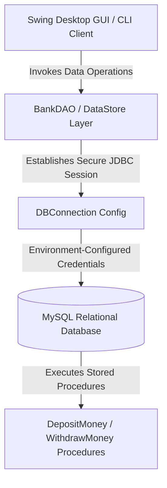
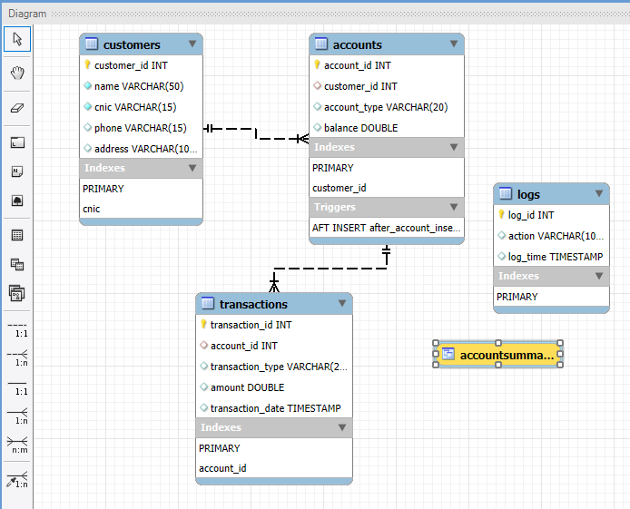
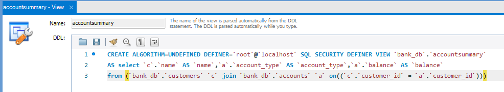

# Banking Management System (Java Swing / JDBC / MySQL)

[](https://github.com/tahniatfarhan/bank-management-system-java/actions/workflows/ci.yml)
[](https://github.com/tahniatfarhan/bank-management-system-java/actions/workflows/codeql.yml)
[](https://opensource.org/licenses/MIT)
[](https://www.oracle.com/java/)
[](https://maven.apache.org/)

> 🎓 **Academic Project Disclaimer:** This repository is an **educational laboratory demonstration project** developed for the Database Systems / Object-Oriented Programming course in the BS Cyber Security degree program at UET Lahore. It demonstrates 3-Tier Architecture, JDBC connection management, Data Access Object (DAO) pattern, and Java Swing GUI components.

---

## 📐 System Architecture

The application adopts a **3-Tier Data Access Object (DAO)** pattern separating UI presentation, domain models, data access objects, and relational database persistence:



---

## 📁 Project Structure

```
bank-management-system-java/
├── .github/
│   ├── dependabot.yml              # Automated monthly dependency scanner
│   └── workflows/
│       ├── ci.yml                  # Maven Build & JUnit 5 test runner
│       └── codeql.yml              # CodeQL Static Application Security Testing
├── assets/
│   ├── diagrams/
│   │   └── ERD.png                 # Relational Database ER Diagram
│   └── screenshots/
│       ├── Output SQL.png          # Database Stored Procedure Execution
│       └── Views.png               # SQL Database Views Output
├── docs/
│   ├── Bank Management System Lab Report.pdf
│   └── sql.mwb                     # MySQL Workbench Model File
├── src/
│   ├── main/java/com/bank/
│   │   ├── dao/
│   │   │   ├── BankDAO.java        # Stored Procedure Data Access Object
│   │   │   ├── DBConnection.java   # Portable Environment JDBC Provider
│   │   │   └── DataStore.java      # Relational Data Loader
│   │   ├── gui/
│   │   │   └── BankGUI.java        # Java Swing User Interface
│   │   ├── model/
│   │   │   ├── Account.java        # Account Entity Model
│   │   │   ├── Bank.java           # Bank Aggregate Container
│   │   │   ├── Customer.java       # Customer Entity Model
│   │   │   └── Person.java         # Base Person Abstract Class
│   │   ├── util/
│   │   │   └── FeedbackStore.java  # Feedback file logging utility
│   │   ├── Client.java             # Terminal Client Entry Point
│   │   └── Main.java               # Swing GUI Application Entry Point
│   └── test/java/com/bank/
│       ├── dao/
│       │   └── BankDAOTest.java    # Mockito DAO Unit Tests
│       └── model/
│           └── BankTest.java       # JUnit 5 Domain Model Tests
├── .env.example                    # Environment variable configuration template
├── .gitignore                      # Git exclusion rules
├── CODE_OF_CONDUCT.md              # Contributor Covenant Code of Conduct
├── CONTRIBUTING.md                 # Contribution guidelines
├── LICENSE                         # MIT License
├── pom.xml                         # Apache Maven build & dependency manifest
├── README.md                       # Comprehensive Project Documentation
└── SECURITY.md                     # Vulnerability reporting security policy
```

---

## 🛡️ Security Notes & Best Practices

- **Zero Hardcoded Credentials:** Database parameters are dynamically parsed from environment variables (`DB_HOST`, `DB_PORT`, `DB_NAME`, `DB_USER`, `DB_PASSWORD`), eliminating security credential leaks.
- **Strict JDBC Resource Management:** All database operations inside `BankDAO` and `DataStore` leverage Java's `try-with-resources` construct (`try (CallableStatement cs = ...)`), guaranteeing automatic release of database connections and statement handles.
- **SQL Injection Defenses:** Transactions and updates utilize parametrized `CallableStatement` stored procedure calls (`CALL DepositMoney(?, ?)`) and parametrized `PreparedStatement` queries.

---

## 🛠️ Installation & Execution

### Prerequisites
- **Java Development Kit (JDK 17 or higher)**
- **Apache Maven 3.8+**
- **MySQL Server 8.0+**

### 1. Database Setup
Execute the relational schema and stored procedures inside MySQL Workbench using `docs/sql.mwb` or run the database DDL script:

```sql
CREATE DATABASE bank_db;
USE bank_db;

-- Execute table creations and procedures defined in docs/Bank Management System Lab Report.pdf
```

### 2. Environment Configuration
Copy `.env.example` to create your local configuration or export system environment variables:

```bash
export DB_HOST="localhost"
export DB_PORT="3306"
export DB_NAME="bank_db"
export DB_USER="root"
export DB_PASSWORD="your_secure_mysql_password"
```

### 3. Build & Test
Compile the codebase and execute unit test suites using Maven:

```bash
# Clean, compile, and run JUnit 5 & Mockito test suites
mvn clean test
```

### 4. Run Application

```bash
# Launch the Swing GUI application
mvn exec:java -Dexec.mainClass="com.bank.Main"
```

---

## 📸 Screenshots & ER Diagram

| Relational ER Diagram | Database SQL Views |
|---|---|
|  |  |

---

## 🚀 Future Improvements

- [ ] Implement HikariCP database connection pooling.
- [ ] Add BCrypt password hashing for customer portal authentication.
- [ ] Integrate H2 in-memory database profile for automated integration testing without requiring a live local MySQL server.

---

## 📄 License & Author

Distributed under the **MIT License**. See [`LICENSE`](LICENSE) for details.

**Author:** [Tahniat Farhan](https://github.com/tahniatfarhan) — BS Cyber Security, UET Lahore.
